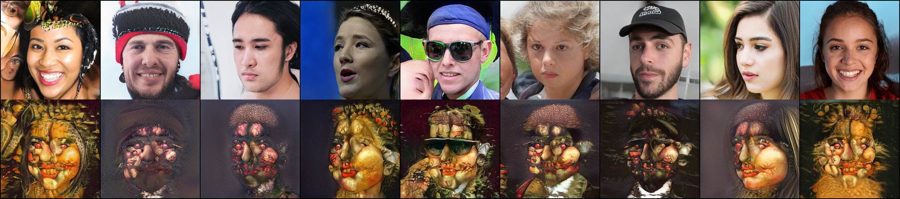
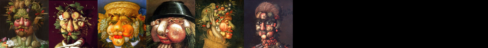
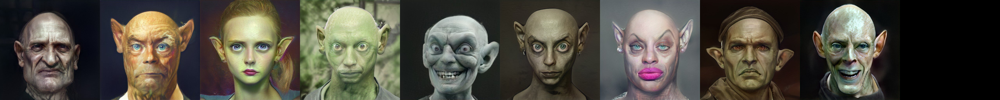

# Few-shot style learning by stylegan2

(My first) Implementaion of [Few-shot Image Generation via Cross-domain Correspondence][1] in PyTorch.

GAN training generally requires a large number of training images, and training on a small number of data often results in overfitting.   
But in this paper, it was possible to do it with only 10 images.  

These are based on [stylegan2-pytorch repository][2] and [this weights][3] like written in the paper.  
I changed some lines in dataset.py, model.py and train.py.  
And I thank for the authors of this paper, stylegan2-pytorch repo, and torchextractor.  

## Requirements
torchextractor  
With google colab, I needed the ninja-linux.  
### I have tested on:
PyTorch 1.7.1  
CUDA 11.1  

## Usage 
Look at the [stylegan2-pytorch repository][2]  

## Results 
### Arcimboldo:1800iter   
  

### Arcimboldo:Source images   
  

### Goblin:1000iter  
  

### Goblin:Source images  
!  

[1]:https://arxiv.org/pdf/2104.06820.pdf
[2]:https://github.com/rosinality/stylegan2-pytorch
[3]:https://drive.google.com/file/d/1PQutd-JboOCOZqmd95XWxWrO8gGEvRcO/

